# Services
A <span style = "color:lightblue">service</span> enable communication between pods and external users.

At launch, Kubernetes will create a default `ClusterIP` service.

## External Access
Components inside a Kubernetes node share the same network which cannot be accessed from outside. Although `ssh` is possible, it is not a good method.

A <span style = "color:lightblue">NodePort service</span> maps the IP of the node through the internal pod network to the IP of a pod hosting an application.

$$
External \rightarrow NodePort \rightarrow Service \rightarrow Port \rightarrow TargetPort \space\rightarrow Pod
$$
The NodePort is in the range of 30000 to 32767.

Once set up, the pod can be accessed using the node's IP address at the forwarded NodePort. The service component will manage pods across all nodes. Accessing the IP of any of the nodes at a specified port will connect to a specified application.

## Internal Access
A <span style = "color:lightblue">ClusterIP</span> creates a virtual IP inside the cluster to enable communication between different services and applications.

For example, within the cluster, a service could be created as an interface to a group of back-end pods for front-end pods to communicate with.

```mermaid
flowchart TD;
	frontend1-->service;
	frontend2-->service;
	frontend3-->service;
	service-->backend1;
	service-->backend2;
	service-->backend3;
style frontend1 fill:#00758f
style frontend2 fill:#00758f
style frontend3 fill:#00758f
style service fill:#1132f0
style backend1 fill:#023020
style backend2 fill:#023020
style backend3 fill:#023020
```



## Load Balancer
A <span style = "color:lightblue">LoadBalancer</span>, in addition to handling external access, manages requests to be forwarded to different pods based on the traffic load. It also manages requests to be forwarded to different **nodes**.

## YAML Configuration
Similar to pods, replica sets, and deployments, a service definition must have the same four required fields. There are three additional **children fields** of the `spec` field that must be added as well.
- `type`: type of service (*shown above*)
- `ports`: information regarding ports to forward traffic
	- `targetPort`: port of the pod
	- `port`: port on the service
	- `nodePort`: port on the node
- `selector`: labels to identify which pods to link to the service

The fields `port` and `targetPort` will be assumed to be the same if one is not given. The field `nodePort` will be automatically allocated to a free port in the valid range if it is not given.

```YAML
# FILE: service-definition.yml
apiVersion: v1
kind: Service
metadata:
	name: myapp-service

spec:
	type: NodePort
	ports:
	- targetPort: 80
	  port: 80
	  nodePort: 30008
	selector:
		app: myapp
		type: front-end
```

The service types are `NodePort`, `ClusterIP`, and `LoadBalancer`. The `ClusterIP` service type does not need a `nodePort` field.

The `create` and `get` command can be used to create the service and get details about services respectively.

```bash
kubectl create service clusterip <APP> --tcp=<PORT>:<PORT>
```

The `expose` command can also be used to create the service.

```bash
kubectl expode pod <APP> --type=<SERVICE_TYPE> --port=<PORT> --name=<SERVICE_NAME>
```

The `--dry-run=client -o yaml` option will test if the command works and output the configuration in the terminal in a YAML format.

> [!INFO]
> A service uses a **random** load-balancing algorithm with `SessionAffinity`.

When creating a pod, the `--expose` and `--port` options will specify a service to be created with the same name as the pod. It can shorten the number of commands needed to be inputted.